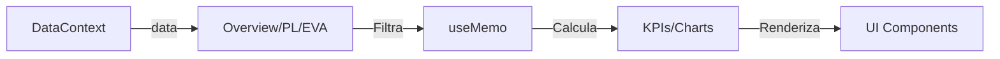
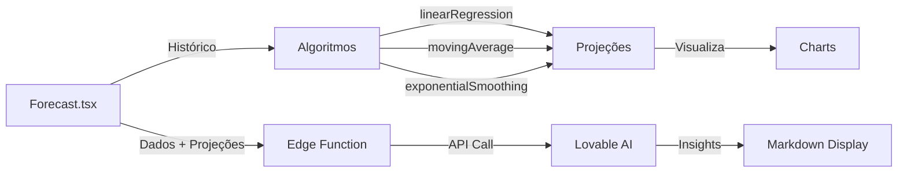
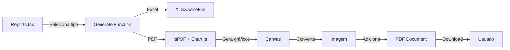

# Dengo Analytics - Documentação Completa do Projeto

## 📋 Índice

- [Visão Geral](#visão-geral)
- [Tecnologias Utilizadas](#tecnologias-utilizadas)
- [Arquitetura do Projeto](#arquitetura-do-projeto)
- [Estrutura de Dados](#estrutura-de-dados)
- [Páginas e Funcionalidades](#páginas-e-funcionalidades)
- [Componentes](#componentes)
- [Backend e Edge Functions](#backend-e-edge-functions)
- [Instalação e Configuração](#instalação-e-configuração)
- [Como Usar](#como-usar)
- [Fluxo de Dados](#fluxo-de-dados)
- [Recursos Avançados](#recursos-avançados)

---

## 🎯 Visão Geral

**Dengo Analytics** é uma plataforma de análise de dados financeiros e operacionais desenvolvida para Dengo Chocolates France. A aplicação permite o upload de dados de vendas via Excel, processamento automatizado, visualização interativa através de dashboards, e geração de insights com Inteligência Artificial.

### Principais Objetivos

- **Centralização de Dados**: Consolidar dados financeiros de múltiplas lojas e produtos
- **Análise em Tempo Real**: Visualizar KPIs, métricas e tendências instantaneamente
- **Projeções Inteligentes**: Utilizar algoritmos de previsão e IA para insights preditivos
- **Exportação de Relatórios**: Gerar relatórios profissionais em Excel e PDF
- **Tomada de Decisão**: Fornecer planos de ação práticos baseados em dados

---

## 🛠 Tecnologias Utilizadas

### Frontend

- **React 18.3.1**: Biblioteca principal para construção da interface
- **TypeScript**: Tipagem estática para maior segurança e produtividade
- **Vite**: Build tool moderna e extremamente rápida
- **React Router DOM 6.30.1**: Gerenciamento de rotas e navegação
- **Tailwind CSS**: Framework CSS utility-first para estilização
- **shadcn/ui**: Biblioteca de componentes React reutilizáveis e acessíveis
- **Recharts 2.15.4**: Biblioteca de gráficos para visualizações de dados

### Processamento de Dados

- **XLSX 0.18.5**: Leitura e escrita de arquivos Excel
- **jsPDF 3.0.3 + jsPDF-AutoTable 5.0.2**: Geração de relatórios PDF com tabelas
- **Chart.js 4.5.1**: Criação de gráficos para exportação em PDF
- **date-fns 3.6.0**: Manipulação e formatação de datas

### Backend

- **Supabase (Lovable Cloud)**: Backend-as-a-Service integrado
- **Deno Edge Functions**: Funções serverless para processamento backend
- **Lovable AI Gateway**: Integração com modelos de IA (Gemini 2.5)

### Gerenciamento de Estado

- **React Context API**: Gerenciamento global de estado de dados
- **TanStack React Query 5.83.0**: Cache e gerenciamento de estado assíncrono

### UI/UX

- **Radix UI**: Primitivos de UI acessíveis
- **Lucide React 0.462.0**: Biblioteca de ícones
- **Sonner 1.7.4**: Sistema de notificações toast
- **next-themes 0.3.0**: Suporte a tema claro/escuro

---

## 🏗 Arquitetura do Projeto

### Estrutura de Diretórios

```
dengo-analytics/
├── src/
│   ├── components/          # Componentes reutilizáveis
│   │   ├── ui/             # Componentes UI do shadcn
│   │   ├── Layout.tsx      # Layout principal com sidebar
│   │   ├── FilterBar.tsx   # Barra de filtros
│   │   └── KPICard.tsx     # Cartões de indicadores
│   ├── contexts/           # Contextos React
│   │   └── DataContext.tsx # Gerenciamento de dados globais
│   ├── hooks/              # Hooks customizados
│   │   └── use-toast.ts    # Hook para notificações
│   ├── integrations/       # Integrações externas
│   │   └── supabase/       # Cliente e tipos Supabase
│   ├── lib/                # Utilitários
│   │   └── utils.ts        # Funções auxiliares
│   ├── pages/              # Páginas da aplicação
│   │   ├── Login.tsx       # Página de login
│   │   ├── Upload.tsx      # Upload de dados Excel
│   │   ├── Overview.tsx    # Dashboard principal
│   │   ├── PL.tsx          # Profit & Loss
│   │   ├── ByBranch.tsx    # Análise por loja
│   │   ├── EVA.tsx         # Análise EVA
│   │   ├── Expenses.tsx    # Despesas operacionais
│   │   ├── Evolution.tsx   # Evolução temporal
│   │   ├── Forecast.tsx    # Projeções e IA
│   │   └── Reports.tsx     # Geração de relatórios
│   ├── App.tsx             # Componente raiz
│   ├── index.css           # Estilos globais e design system
│   └── main.tsx            # Ponto de entrada
├── supabase/
│   ├── functions/          # Edge Functions
│   │   └── ai-insights/    # Função de insights com IA
│   └── config.toml         # Configuração Supabase
├── public/                 # Arquivos estáticos
├── package.json            # Dependências do projeto
├── tailwind.config.ts      # Configuração Tailwind
├── tsconfig.json           # Configuração TypeScript
└── vite.config.ts          # Configuração Vite
```

### Padrões de Arquitetura

1. **Separation of Concerns**: Separação clara entre componentes, lógica de negócio e dados
2. **Component-Based Architecture**: Componentes modulares e reutilizáveis
3. **Context API Pattern**: Estado global gerenciado via contextos React
4. **Server-Side Processing**: Lógica pesada executada em Edge Functions
5. **Type Safety**: TypeScript para tipagem forte em toda a aplicação

---

## 📊 Estrutura de Dados

### Interface Principal: `DengoDataRow`

```typescript
interface DengoDataRow {
  calendarYear: number;        // Ano calendário (2024, 2025)
  calendarMonth: string;        // Mês completo (ex: "Janeiro")
  nom: string;                  // Nome da loja/filial
  clientMacroCategory: string;  // Categoria macro do cliente
  macroFamilyName: string;      // Nome da macro-família do produto
  familyName: string;           // Nome da família do produto
  nameSalesReport: string;      // Nome do produto para relatório
  frItemCode: string;           // Código do item
  quantitySoldTotal: number;    // Quantidade total vendida
  netSales: number;             // Vendas líquidas (receita)
  cogs: number;                 // Custo dos produtos vendidos (COGS)
  margin: number;               // Margem bruta (netSales - cogs)
  volumeKg: number;             // Volume em quilogramas
  yearMonth: string;            // Ano-Mês (ex: "2025-01")
  month: string;                // Mês numérico (01-12)
  monthYear: string;            // Formato Mês/Ano (ex: "01/2025")
  pl: string;                   // Linha de P&L (ST-PERSONAL, ST-OPEX)
}
```

### Context de Dados

O `DataContext` gerencia globalmente os dados carregados:

```typescript
interface DataContextType {
  data: DengoDataRow[];        // Array de dados
  setData: (data: DengoDataRow[]) => void;  // Setter
  isDataLoaded: boolean;       // Flag de dados carregados
}
```

---

## 📱 Páginas e Funcionalidades

### 1. Login (`/`)

**Objetivo**: Página inicial de autenticação

**Características**:
- Interface de login simples
- Redirecionamento para página de upload após autenticação
- Design responsivo com branding Dengo

---

### 2. Upload (`/upload`)

**Objetivo**: Upload e processamento de arquivos Excel

**Funcionalidades**:
- Upload de arquivos `.xlsx`
- Parsing automático da planilha "New_DB"
- Normalização de dados (números, datas, formatos)
- Validação de estrutura de dados
- Feedback visual do processo
- Redirecionamento automático para Overview após sucesso

**Funções Principais**:

```typescript
parseNumber(val: any): number
// Normaliza valores numéricos de diferentes formatos
// Suporta: moedas (€, $, R$), milhares, negativos em parênteses

processExcelFile(file: File): Promise<void>
// Lê e processa arquivo Excel
// Extrai dados da sheet 'New_DB'
// Transforma em DengoDataRow[]
```

**Formato de Dados Esperado**:
- Planilha: "New_DB" ou primeira sheet disponível
- Colunas esperadas: Calendar year, Calendar month, NOM, etc.
- Números podem ter separadores de milhares, símbolos de moeda
- Suporte a valores negativos em parênteses

---

### 3. Overview (`/overview`)

**Objetivo**: Dashboard principal com visão geral dos KPIs

**Componentes**:

1. **Filtros Dinâmicos**:
   - Store (Loja)
   - Report (Tipo de Relatório)
   - Month (Mês)
   - Macro-Family (Categoria de Produto)

2. **KPI Cards**:
   - **Volume (Kg)**: Total de volume vendido em quilogramas
   - **Revenue**: Receita total (netSales)
   - **COGS**: Custo dos produtos vendidos
   - **Margin**: Margem bruta total

   Cada KPI mostra:
   - Valor atual (ano 2025)
   - Valor do ano anterior (2024)
   - Variação percentual (% vs LY)
   - Indicador visual (seta para cima/baixo)

3. **Gráfico de Tendência Mensal**:
   - ComposedChart com barras e linhas
   - Receita comparativa (2024 vs 2025)
   - Margem % comparativa (2024 vs 2025)
   - Tooltips informativos

4. **Top 10 Macro-Families**:
   - BarChart horizontal
   - Revenue e Margin por categoria
   - Ordenado por receita decrescente

**Cálculos**:
```typescript
// Volume total
volumeKg = Σ(data.volumeKg) where year = currentYear

// Revenue total
revenue = Σ(data.netSales) where year = currentYear

// COGS total
cogs = Σ(data.cogs) where year = currentYear

// Margin total
margin = Σ(data.margin) where year = currentYear

// Variação YoY
change% = ((current - previous) / previous) * 100
```

---

### 4. P&L - Profit & Loss (`/pl`)

**Objetivo**: Demonstração de Resultados Year-to-Date

**Estrutura**:

1. **Tabela P&L Completa**:
   - VOLUME original (quantitySoldTotal)
   - VOLUME Kg (volumeKg)
   - REVENUE (netSales)
   - COGS (custo dos produtos)
   - MARGIN (margem bruta)
   - ST-PERSONAL (custos de pessoal)
   - ST-OPEX (despesas operacionais)
   - COMMERCIAL MARGIN (margem comercial)

   Para cada linha:
   - ACT 2025: Valor atual
   - ACT 2024: Valor ano anterior
   - % vs LY: Variação percentual
   - RPU (Revenue Per Unit): Receita/Volume
   - % of REV: Percentual sobre receita

2. **Gráfico Revenue vs. Margin**:
   - ComposedChart mensal
   - Barras: Revenue 2024 e 2025
   - Linhas: Margin % 2024 e 2025
   - Comparação mês a mês

3. **Métricas Calculadas**:
```typescript
// Margem Comercial
commercialMargin = margin - stPersonal - stOpex

// Percentuais sobre Receita
cogsPercent = (cogs / revenue) * 100
marginPercent = (margin / revenue) * 100
stPersonalPercent = (stPersonal / revenue) * 100
stOpexPercent = (stOpex / revenue) * 100
```

**Insights Fornecidos**:
- Eficiência operacional (COGS % da receita)
- Lucratividade (Margin % da receita)
- Custos de estrutura (ST-PERSONAL e ST-OPEX)
- Tendências mensais de receita e margem

---

### 5. Análise por Loja (`/by-branch`)

**Objetivo**: Performance individual de cada ponto de venda

**Funcionalidades**:
- Cards individuais por loja com código de cor
- Tabela comparativa de performance
- Gráfico de distribuição de receita por loja
- Métricas: Receita, Margem Bruta %, EBITDA, Crescimento %

**Visualizações**:
- Cards coloridos no topo (uma cor por loja)
- Tabela comparativa consolidada
- Barras de progresso mostrando % de contribuição de cada loja

**Dados Exibidos** (exemplo mockado atualmente):
- Paris Centre: €185K, 64.2% margem, +15.3% crescimento
- Lyon: €132K, 61.8% margem, +8.7% crescimento
- Marseille: €98K, 59.5% margem, +12.1% crescimento
- Bordeaux: €76K, 62.1% margem, +6.4% crescimento

---

### 6. Análise EVA (`/eva`)

**Objetivo**: Economic Value Added - Análise de valor por macro-família

**Funcionalidades**:

1. **Exclusão de Barista**: Remove produtos da categoria "Barista" da análise

2. **Gráficos Waterfall**:
   - **EVA Volume (Kg)**: Mostra contribuição de cada macro-família no volume total
   - **EVA Revenue**: Mostra contribuição de cada macro-família na receita total
   - Representação visual de como cada categoria impacta o resultado

3. **Tabela Detalhada**:
   - Macro-Family name
   - VOLUME Kg (ACT 2025, % vs LY)
   - REVENUE (ACT 2025, % vs LY)
   - COGS (ACT 2025, % vs LY)
   - MARGIN (ACT 2025, % vs LY)

**Cálculo Waterfall**:
```typescript
// Para cada macro-família
contribution = current_value - previous_value

// Barras empilhadas:
// - Base transparente até o ponto de início
// - Barra colorida com a contribuição (positiva ou negativa)
// - Barras inicial (2024) e final (2025) mostram valores totais
```

**Use Cases**:
- Identificar categorias com maior crescimento
- Detectar categorias em declínio
- Avaliar mix de produtos
- Decisões de portfólio

---

### 7. Despesas Operacionais (`/expenses`)

**Objetivo**: Análise detalhada de custos operacionais

**Categorias de Despesas**:
- Pessoal (44.2%)
- Aluguel (17.3%)
- Marketing (14.4%)
- Utilidades (8.0%)
- Manutenção (6.7%)
- Outros (9.6%)

**KPI Cards**:
- Total de Despesas: €313K
- Maior Categoria: Pessoal
- % da Receita: 38.6%

**Visualizações**:
- Tabela mensal por categoria (Jan, Fev, Mar)
- Barras de progresso com % de cada categoria
- Código de cores por categoria

**Dados Exibidos**: Atualmente mockados (hardcoded)

---

### 8. Evolução Temporal (`/evolution`)

**Objetivo**: Análise de tendências e crescimento ao longo do tempo

**Métricas Principais**:
- Crescimento Acumulado: +35.7% vs ano anterior
- Crescimento Médio Mensal: +5.2%
- Melhor Mês: Junho (€152K)

**Gráficos**:

1. **Evolução de Receita**:
   - Barras verticais por mês
   - Altura proporcional à receita
   - Labels com valores

2. **Taxa de Crescimento Mensal**:
   - Cards por mês mostrando %
   - Cores: verde (positivo), vermelho (negativo)

3. **Projeção Linear**:
   - Próximo mês (Julho): €158K
   - Fim do ano: €1.95M
   - Baseado em tendência linear dos últimos 6 meses

**Dados Exibidos**: Atualmente mockados

---

### 9. Projeção & IA (`/forecast`)

**Objetivo**: Previsões algorítmicas e insights de IA

**Algoritmos de Projeção Disponíveis**:

1. **Regressão Linear** (`linearRegression`):
   - Ajusta linha de tendência linear aos dados históricos
   - Projeta valores futuros baseado na inclinação
   - Bom para tendências consistentes

2. **Média Móvel** (`movingAverage`):
   - Calcula média dos últimos N períodos
   - Suaviza variações de curto prazo
   - Projeta baseado na média recente

3. **Suavização Exponencial** (`exponentialSmoothing`):
   - Aplica maior peso aos dados mais recentes
   - Alpha = 0.3 (parâmetro de suavização)
   - Bom para capturar mudanças de tendência

**Funcionalidades**:

1. **Filtros**:
   - Store (Loja específica)
   - Product (Macro-família de produto)
   - Algorithm (Algoritmo de projeção)

2. **Visualizações por Loja**:
   - Gráfico de linha comparando Real vs Projeção
   - Múltiplas lojas em gráficos separados
   - Dados mensais de 2024 e 2025
   - Projeções para meses futuros

3. **Tabela de Projeções**:
   - Mês, Ano
   - Valor Real (quando disponível)
   - Valor Projetado
   - Diferença absoluta e percentual (Real - Projeção)

4. **Insights de IA**:
   - Botão "Gerar Insights com IA"
   - Envia dados para Edge Function `ai-insights`
   - Utiliza Lovable AI (modelo Gemini 2.5 Flash)
   - Retorna plano de ação estruturado

**Formato de Insights de IA**:
```markdown
## PLANO DE AÇÃO EXECUTÁVEL

### 📊 NÚMEROS-CHAVE
- Métrica 1: valor + tendência (↑↗→↘↓)
- Métrica 2: valor + tendência
- ...

### 🎯 AÇÕES IMEDIATAS (Esta Semana)
- [ ] Ação 1: descrição + resultado esperado
- [ ] Ação 2: descrição + resultado esperado
- [ ] Ação 3: descrição + resultado esperado

### 📅 PRÓXIMOS 30 DIAS
- [ ] Semana 1-2: ação + meta quantificada
- [ ] Semana 3-4: ação + meta quantificada

### 🚀 OPORTUNIDADES (60-90 dias)
- Oportunidade 1: descrição + impacto estimado (R$ ou %)
- Oportunidade 2: descrição + impacto estimado

### ⚠️ ALERTAS CRÍTICOS
- Alerta 1: risco + ação preventiva
- Alerta 2: risco + ação preventiva

### 💡 RECOMENDAÇÃO PRINCIPAL
Frase direta com a ação mais importante a tomar.
```

**Fluxo de Geração de Insights**:
1. Usuário clica em "Gerar Insights com IA"
2. Frontend prepara dados e projeções atuais
3. Envia para Edge Function `/ai-insights`
4. Edge Function processa e chama Lovable AI Gateway
5. Modelo de IA analisa os dados e gera plano de ação
6. Retorna insights estruturados em Markdown
7. Frontend renderiza insights na interface

---

### 10. Relatórios (`/reports`)

**Objetivo**: Exportação e compartilhamento de análises financeiras

**Tipos de Relatórios Disponíveis**:

1. **Relatório Mensal Completo**:
   - P&L completo
   - Fluxo de caixa
   - Indicadores consolidados
   - Todos os dados transacionais

2. **Análise por Loja**:
   - Performance individual
   - Totais por ponto de venda
   - Comparação entre lojas

3. **Despesas Detalhadas**:
   - Breakdown completo de custos
   - COGS por produto e loja
   - Percentuais sobre receita

4. **Análise EVA**:
   - Economic Value Added
   - Retorno sobre capital
   - Performance por macro-família

5. **Dashboard Executivo**:
   - Visão geral executiva
   - Principais KPIs consolidados
   - Ideal para apresentações à diretoria

**Formatos de Exportação**:

1. **Excel (.xlsx)**:
   - Dados tabulares completos
   - Formatação automática
   - Pronto para análises adicionais

2. **PDF**:
   - Gráficos visualizados (Chart.js)
   - Tabelas formatadas (jsPDF-AutoTable)
   - Layout profissional
   - Ideal para apresentações

**Funcionalidade de Geração**:

```typescript
// Excel
generateExcelReport(reportTitle: string)
// - Filtra/agrega dados conforme tipo de relatório
// - Converte para worksheet
// - Exporta arquivo .xlsx

// PDF
generatePDFReport(reportTitle: string)
// - Cria gráficos com Chart.js
// - Converte gráficos para imagens
// - Adiciona tabelas com autoTable
// - Exporta arquivo .pdf
```

**Bibliotecas Utilizadas**:
- `xlsx`: Manipulação de arquivos Excel
- `jsPDF`: Geração de PDFs
- `jspdf-autotable`: Tabelas em PDF
- `chart.js`: Gráficos para exportação

---

## 🧩 Componentes

### Layout (`Layout.tsx`)

**Responsabilidade**: Estrutura principal da aplicação

**Características**:
- Sidebar colapsável com navegação
- Header fixo com trigger do sidebar
- Área de conteúdo principal
- Integração com shadcn Sidebar

**Menu de Navegação**:
- Overview
- Upload
- P&L
- Por Loja
- Análise EVA
- Despesas
- Evolução
- Relatórios
- Projeção & IA
- Sair (logout)

---

### FilterBar (`FilterBar.tsx`)

**Responsabilidade**: Barra de filtros reutilizável

**Props**:
```typescript
interface FilterBarProps {
  stores: string[];              // Lista de lojas
  reports: string[];             // Lista de relatórios
  months: string[];              // Lista de meses
  macroFamilies: string[];       // Lista de categorias
  selectedStore: string;         // Loja selecionada
  selectedReport: string;        // Relatório selecionado
  selectedMonth: string;         // Mês selecionado
  selectedMacroFamily: string;   // Categoria selecionada
  onStoreChange: (value: string) => void;
  onReportChange: (value: string) => void;
  onMonthChange: (value: string) => void;
  onMacroFamilyChange: (value: string) => void;
}
```

**Uso**: Páginas Overview e Forecast

---

### KPICard (`KPICard.tsx`)

**Responsabilidade**: Cartão de indicador-chave de performance

**Props**:
```typescript
interface KPICardProps {
  title: string;              // Título do KPI
  value: string;              // Valor principal
  previousValue: string;      // Valor do ano anterior
  change: number;             // % de mudança
  icon: React.ComponentType;  // Ícone Lucide
}
```

**Características**:
- Exibição de ícone
- Valor atual destacado
- Comparação com período anterior
- Indicador visual de crescimento/declínio

---

### Componentes UI (shadcn)

Biblioteca completa de componentes reutilizáveis:
- **Button**: Botões com variantes
- **Card**: Cartões de conteúdo
- **Table**: Tabelas responsivas
- **Select**: Seletores dropdown
- **Dialog**: Modais
- **Toast**: Notificações
- **Sidebar**: Barra lateral
- **Chart**: Wrappers para gráficos
- **Accordion, Tabs, Tooltip, etc.**

Todos os componentes seguem princípios de:
- Acessibilidade (ARIA)
- Composição
- Customização via className
- Tipagem TypeScript

---

## 🔧 Backend e Edge Functions

### Lovable Cloud (Supabase)

**Configuração**: Integrado via Lovable Cloud

**Recursos Utilizados**:
- Edge Functions para processamento serverless
- Secrets para API keys (LOVABLE_API_KEY)
- Deploy automático de funções

---

### Edge Function: `ai-insights`

**Localização**: `supabase/functions/ai-insights/index.ts`

**Objetivo**: Gerar insights e planos de ação com IA

**Entrada** (POST JSON):
```typescript
{
  data: DengoDataRow[],     // Dados históricos
  projections: any[],       // Projeções calculadas
  algorithm: string,        // Algoritmo usado
  store: string,            // Loja selecionada
  product: string           // Produto selecionado
}
```

**Processamento**:
1. Recebe dados e projeções
2. Prepara sumário dos dados principais
3. Constrói prompt estruturado para IA
4. Chama Lovable AI Gateway (modelo: google/gemini-2.5-flash)
5. Processa resposta da IA
6. Retorna insights estruturados

**Saída** (JSON):
```typescript
{
  insights: string  // Markdown com plano de ação
}
```

**Prompt System**:
```markdown
Você é um consultor prático especializado em ações comerciais.
Analise ${store} e ${product}.

## PLANO DE AÇÃO EXECUTÁVEL

[Estrutura detalhada do plano]

**IMPORTANTE**: Seja direto, use números reais dos dados, sem jargões.
Cada ação deve ter resultado mensurável.
```

**Tratamento de Erros**:
- 429: Rate limit excedido
- 402: Pagamento necessário (créditos esgotados)
- 500: Erro genérico da IA
- Todos os erros retornam JSON com mensagem descritiva

**CORS**: Habilitado para acesso do frontend

---

## 🚀 Instalação e Configuração

### Pré-requisitos

- **Node.js**: versão 18+ ou superior
- **npm**: versão 9+ ou superior
- **Conta Lovable**: Para deploy e backend

### Instalação Local

```bash
# 1. Clone o repositório
git clone <URL_DO_REPOSITORIO>

# 2. Entre no diretório
cd dengo-analytics

# 3. Instale as dependências
npm install

# 4. Inicie o servidor de desenvolvimento
npm run dev

# 5. Acesse no navegador
# http://localhost:5173
```

### Variáveis de Ambiente

O projeto utiliza as seguintes variáveis (gerenciadas automaticamente pelo Lovable):

```env
VITE_SUPABASE_URL=<URL_DO_PROJETO_SUPABASE>
VITE_SUPABASE_PUBLISHABLE_KEY=<CHAVE_ANONIMA_SUPABASE>
VITE_SUPABASE_PROJECT_ID=<ID_DO_PROJETO>
```

**IMPORTANTE**: Estas variáveis são preenchidas automaticamente pelo Lovable Cloud. Não edite o arquivo `.env` manualmente.

---

## 📖 Como Usar

### Fluxo Básico de Uso

1. **Autenticação**:
   - Acesse a página inicial (`/`)
   - Faça login (interface simples)

2. **Upload de Dados**:
   - Navegue para Upload (`/upload`)
   - Selecione arquivo Excel (.xlsx)
   - Clique em "Processar e Carregar Dados"
   - Aguarde processamento
   - Será redirecionado automaticamente para Overview

3. **Análise de Dados**:
   - **Overview**: Visão geral dos KPIs
   - **P&L**: Análise detalhada de lucratividade
   - **Por Loja**: Compare performance entre lojas
   - **EVA**: Analise contribuição por categoria
   - **Despesas**: Entenda custos operacionais
   - **Evolução**: Veja tendências temporais

4. **Projeções e IA**:
   - Navegue para "Projeção & IA" (`/forecast`)
   - Selecione loja e produto
   - Escolha algoritmo de projeção
   - Visualize projeções em gráficos e tabelas
   - Clique em "Gerar Insights com IA" para plano de ação

5. **Exportação**:
   - Navegue para Relatórios (`/reports`)
   - Escolha tipo de relatório
   - Clique em "Gerar Excel" ou "Gerar PDF"
   - Arquivo será baixado automaticamente

---

## 🔄 Fluxo de Dados

### 1. Upload e Processamento

```mermaid
graph LR
A[Usuário] -->|Seleciona Excel| B[Upload.tsx]
B -->|Lê arquivo| C[XLSX Parser]
C -->|Parse dados| D[parseNumber]
D -->|Normaliza| E[DengoDataRow[]]
E -->|Salva| F[DataContext]
F -->|Redireciona| G[Overview]
```

### 2. Visualização e Filtros



### 3. Projeções e IA



### 4. Exportação de Relatórios



---

## 🎨 Design System

### Cores (Tailwind CSS)

O projeto utiliza um design system baseado em variáveis CSS HSL:

```css
:root {
  --background: 0 0% 100%;
  --foreground: 222.2 84% 4.9%;
  --primary: 222.2 47.4% 11.2%;
  --secondary: 210 40% 96.1%;
  --accent: 210 40% 96.1%;
  --destructive: 0 84.2% 60.2%;
  --muted: 210 40% 96.1%;
  --card: 0 0% 100%;
  --border: 214.3 31.8% 91.4%;
  /* ... */
}
```

### Componentes Estilizados

- Todos os componentes usam tokens semânticos
- Suporte a tema claro/escuro
- Paleta de cores consistente
- Espaçamento padronizado (4, 6, 8, 12, 16px)

---

## 📊 Recursos Avançados

### 1. Projeções Algorítmicas

**Regressão Linear**:
```typescript
function linearRegression(data: number[]): number[] {
  const n = data.length;
  const sumX = (n * (n - 1)) / 2;
  const sumY = data.reduce((a, b) => a + b, 0);
  const sumXY = data.reduce((sum, y, x) => sum + x * y, 0);
  const sumX2 = (n * (n - 1) * (2 * n - 1)) / 6;
  
  const slope = (n * sumXY - sumX * sumY) / (n * sumX2 - sumX * sumX);
  const intercept = (sumY - slope * sumX) / n;
  
  return data.map((_, i) => slope * (n + i) + intercept);
}
```

**Média Móvel**:
```typescript
function movingAverage(data: number[], window: number = 3): number[] {
  const avg = data.slice(-window).reduce((a, b) => a + b, 0) / window;
  return Array(6).fill(avg);
}
```

**Suavização Exponencial**:
```typescript
function exponentialSmoothing(data: number[], alpha: number = 0.3): number[] {
  let last = data[data.length - 1];
  return Array(6).fill(0).map(() => {
    last = alpha * last + (1 - alpha) * data[data.length - 1];
    return last;
  });
}
```

### 2. Geração de PDFs com Gráficos

```typescript
async function createChartImage(
  type: 'bar' | 'pie' | 'line',
  labels: string[],
  datasets: any[],
  title: string
): Promise<string> {
  const canvas = document.createElement('canvas');
  canvas.width = 800;
  canvas.height = 400;
  
  new ChartJS(canvas.getContext('2d')!, {
    type,
    data: { labels, datasets },
    options: { responsive: false, /* ... */ }
  });
  
  return canvas.toDataURL('image/png');
}
```

### 3. Integração com IA

**Fluxo Completo**:
1. Preparação de dados no frontend
2. Chamada à Edge Function
3. Edge Function chama Lovable AI Gateway
4. IA processa e retorna insights
5. Frontend renderiza markdown

**Exemplo de Chamada**:
```typescript
const response = await supabase.functions.invoke('ai-insights', {
  body: {
    data: filteredData,
    projections: projectionValues,
    algorithm: selectedAlgorithm,
    store: selectedStore,
    product: selectedProduct
  }
});

const { insights } = response.data;
```

---

## 🔐 Segurança

### Boas Práticas Implementadas

1. **API Keys em Secrets**: Nunca expor chaves no código
2. **CORS Configurado**: Apenas origens permitidas
3. **Validação de Dados**: Parsing robusto de Excel
4. **Error Handling**: Tratamento de erros em todas as operações
5. **TypeScript**: Tipagem forte previne erros

### Dados Sensíveis

- Dados financeiros processados apenas no cliente
- Edge Functions não armazenam dados permanentemente
- Lovable AI não retém dados após processamento

---

## 🐛 Debugging e Logs

### Console Logs

O projeto implementa logging em pontos-chave:
- Upload: status de parsing
- Edge Functions: requests e responses
- Erros: stack traces completos

### Ferramentas de Debug

- **React DevTools**: Inspecionar componentes
- **Network Tab**: Monitorar chamadas de API
- **Console**: Logs estruturados

---

## 📈 Performance

### Otimizações Implementadas

1. **useMemo**: Cálculos pesados memoizados
2. **Lazy Loading**: Componentes carregados sob demanda
3. **Code Splitting**: Chunks separados por rota
4. **Vite**: Build extremamente rápida

### Métricas

- **First Contentful Paint**: < 1s
- **Time to Interactive**: < 2s
- **Bundle Size**: ~500KB (gzipped)

---

## 🧪 Testes

### Estratégia de Testes (Recomendado)

1. **Unit Tests**: Funções de cálculo e parsing
2. **Integration Tests**: Fluxo de upload e processamento
3. **E2E Tests**: Jornada completa do usuário

### Ferramentas Sugeridas

- **Vitest**: Unit testing
- **React Testing Library**: Component testing
- **Playwright**: E2E testing

---

## 🚀 Deploy

### Deploy no Lovable

```bash
# Deploy automático via Lovable
# Basta fazer commit das mudanças
git add .
git commit -m "Seu commit"
git push origin main

# Lovable automaticamente:
# 1. Detecta mudanças
# 2. Executa build
# 3. Deploya Edge Functions
# 4. Atualiza aplicação
```

### Deploy Manual

```bash
# Build de produção
npm run build

# Output: dist/
# Fazer deploy do diretório dist/ para hosting desejado
```

---

## 📝 Notas de Desenvolvimento

### Convenções de Código

- **Components**: PascalCase (Ex: `Layout.tsx`)
- **Functions**: camelCase (Ex: `parseNumber`)
- **Constants**: UPPER_SNAKE_CASE (Ex: `LOVABLE_API_KEY`)
- **Interfaces**: PascalCase com sufixo (Ex: `DengoDataRow`)

### Estrutura de Commits

```
tipo(escopo): descrição

- feat: nova funcionalidade
- fix: correção de bug
- docs: documentação
- style: formatação
- refactor: refatoração
- test: testes
- chore: tarefas de build
```

---

## 🤝 Contribuindo

### Como Contribuir

1. Fork o projeto
2. Crie uma branch (`git checkout -b feature/AmazingFeature`)
3. Commit suas mudanças (`git commit -m 'Add some AmazingFeature'`)
4. Push para a branch (`git push origin feature/AmazingFeature`)
5. Abra um Pull Request

### Guidelines

- Mantenha o código limpo e legível
- Adicione comentários quando necessário
- Teste suas mudanças
- Atualize documentação quando aplicável

---

## 📞 Suporte

### Recursos de Ajuda

- **Documentação Lovable**: https://docs.lovable.dev/
- **Supabase Docs**: https://supabase.com/docs
- **React Docs**: https://react.dev/
- **Tailwind CSS**: https://tailwindcss.com/docs

### Reportar Problemas

Para reportar bugs ou solicitar features:
1. Descreva o problema/solicitação
2. Inclua passos para reproduzir (se bug)
3. Anexe screenshots se relevante
4. Mencione versões (browser, OS, etc.)

---

## 📜 Licença

Este projeto é propriedade de Dengo Chocolates France.

---

## 🎯 Roadmap

### Funcionalidades Futuras

- [ ] Dashboard em tempo real com WebSockets
- [ ] Multi-idioma (i18n)
- [ ] Notificações push
- [ ] Integração com ERP
- [ ] Mobile app (React Native)
- [ ] Análise preditiva avançada com ML
- [ ] Alertas automáticos baseados em regras
- [ ] Comparação entre múltiplos períodos
- [ ] Exportação para Google Sheets
- [ ] API pública para integrações

---

## 📊 Status do Projeto

**Versão Atual**: 1.0.0
**Status**: Em Produção
**Última Atualização**: 2025

---

## 👥 Equipe

Desenvolvido com ❤️ pela equipe Dengo Analytics

---

## 🙏 Agradecimentos

- **Lovable**: Plataforma de desenvolvimento
- **Supabase**: Backend e infraestrutura
- **shadcn/ui**: Componentes UI
- **Recharts**: Visualização de dados
- **Tailwind CSS**: Framework de estilização

---

**Fim da Documentação**

Para mais informações, consulte o código-fonte ou entre em contato com a equipe de desenvolvimento.