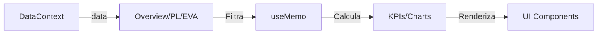
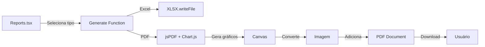

# Dengo Analytics - Documentação Completa do Projeto

## 📋 Índice

- [Visão Geral](#visão-geral)
- [Tecnologias Utilizadas](#tecnologias-utilizadas)
- [Arquitetura do Projeto](#arquitetura-do-projeto)
- [Estrutura de Dados](#estrutura-de-dados)
- [Páginas e Funcionalidades](#páginas-e-funcionalidades)
- [Componentes](#componentes)
- [Backend](#backend)
- [Instalação e Configuração](#instalação-e-configuração)
- [Como Usar](#como-usar)
- [Fluxo de Dados](#fluxo-de-dados)

---

## 🎯 Visão Geral

**Dengo Analytics** é uma plataforma de análise de dados financeiros e operacionais desenvolvida para Dengo Chocolates France. A aplicação permite o upload de dados de vendas via Excel, processamento automatizado, visualização interativa através de dashboards e geração de relatórios profissionais.

### Principais Objetivos

- **Centralização de Dados**: Consolidar dados financeiros de múltiplas lojas e produtos
- **Análise em Tempo Real**: Visualizar KPIs, métricas e tendências instantaneamente
- **Exportação de Relatórios**: Gerar relatórios profissionais em Excel e PDF
- **Tomada de Decisão**: Fornecer informações práticas baseadas em dados

---

## 🛠 Tecnologias Utilizadas

### Frontend

- **React 18.3.1**: Biblioteca principal para construção da interface
- **TypeScript**: Tipagem estática para maior segurança e produtividade
- **Vite**: Build tool moderna e extremamente rápida
- **React Router DOM 6.30.1**: Gerenciamento de rotas e navegação
- **Tailwind CSS**: Framework CSS utility-first para estilização
- **shadcn/ui**: Biblioteca de componentes React reutilizáveis e acessíveis
- **Recharts 2.15.4**: Biblioteca de gráficos para visualizações de dados

### Processamento de Dados

- **XLSX 0.18.5**: Leitura e escrita de arquivos Excel
- **ExcelJS 4.4.0**: Manipulação avançada de arquivos Excel
- **jsPDF 3.0.3 + jsPDF-AutoTable 5.0.2**: Geração de relatórios PDF com tabelas
- **Chart.js 4.5.1**: Criação de gráficos para exportação em PDF
- **date-fns 3.6.0**: Manipulação e formatação de datas

### Backend

- **Lovable Cloud**: Backend-as-a-Service integrado

### Gerenciamento de Estado

- **React Context API**: Gerenciamento global de estado de dados
- **TanStack React Query 5.83.0**: Cache e gerenciamento de estado assíncrono

### UI/UX

- **Radix UI**: Primitivos de UI acessíveis
- **Lucide React 0.462.0**: Biblioteca de ícones
- **Sonner 1.7.4**: Sistema de notificações toast
- **next-themes 0.3.0**: Suporte a tema claro/escuro

---

## 🏗 Arquitetura do Projeto

### Arquitetura de 3 Camadas

O projeto é estruturado em 3 camadas arquiteturais distintas:

```
┌─────────────────────────────────────────────────────────────────┐
│                    LAYER 3 - OUTPUT LAYER                       │
│  Exportação (Excel, PDF), Relatórios Contábeis                 │
├─────────────────────────────────────────────────────────────────┤
│                    LAYER 2 - INTERFACE LAYER                    │
│  Dashboards Interativos com Filtros                            │
├─────────────────────────────────────────────────────────────────┤
│                    LAYER 1 - DATA LAYER                         │
│  Importação Excel (sheet 'New_DB') → Campos Estruturais DRE    │
└─────────────────────────────────────────────────────────────────┘
```

#### Layer 1 - Data Layer
- **Entrada**: Arquivos Excel com sheet `New_DB`
- **Campos disponíveis**: `nom`, `macroFamilyName`, `calendarYear`, `month`, `netSales`, `cogs`, `margin`, `volumeKg`, `quantitySoldTotal`
- **Processamento**: Normalização robusta de headers Excel

#### Layer 2 - Interface Layer
- **Dashboards**: Overview, P&L, Por Loja, Por Categoria, EVA, Relatório EVA, Despesas, Evolução
- **Interatividade**: Filtros por ano, mês, loja, linha de produto
- **Exportação inline**: `ExportButtons` em cada dashboard

#### Layer 3 - Output Layer
- **Exportação**: Excel (gráficos nativos editáveis), PDF (gráficos embarcados)
- **Relatórios**: Relatório Contábil Mensal consolidado

### Estrutura de Diretórios

```
dengo-analytics/
├── src/
│   ├── components/              # Componentes reutilizáveis
│   │   ├── ui/                 # Componentes UI do shadcn
│   │   ├── Layout.tsx          # Layout principal com sidebar
│   │   ├── FilterBar.tsx       # Barra de filtros
│   │   ├── KPICard.tsx         # Cartões de indicadores
│   │   ├── ExportButtons.tsx   # Botões de exportação (Excel/PDF)
│   │   └── ProtectedRoute.tsx  # Proteção de rotas
│   ├── contexts/               # Contextos React
│   │   ├── DataContext.tsx     # Gerenciamento de dados globais
│   │   └── AuthContext.tsx     # Contexto de autenticação
│   ├── hooks/                  # Hooks customizados
│   │   ├── use-toast.ts        # Hook para notificações
│   │   ├── use-mobile.tsx      # Detecção de dispositivo móvel
│   │   └── useTracking.tsx     # Rastreamento de uso
│   ├── integrations/           # Integrações externas
│   │   └── supabase/           # Cliente e tipos Supabase
│   ├── lib/                    # Utilitários
│   │   └── utils.ts            # Funções auxiliares
│   ├── pages/                  # Páginas da aplicação
│   │   ├── Overview.tsx        # Dashboard principal
│   │   ├── Upload.tsx          # Upload de dados Excel
│   │   ├── PL.tsx              # Profit & Loss
│   │   ├── ByBranch.tsx        # Análise por loja
│   │   ├── ByCategory.tsx      # Análise por categoria
│   │   ├── EVA.tsx             # Análise EVA
│   │   ├── EVAReport.tsx       # Relatório EVA
│   │   ├── Expenses.tsx        # Despesas operacionais
│   │   ├── Evolution.tsx       # Evolução temporal
│   │   ├── Reports.tsx         # Relatório Contábil Mensal
│   │   ├── Admin.tsx           # Painel administrativo
│   │   ├── Login.tsx           # Página de login
│   │   └── NotFound.tsx        # Página 404
│   ├── App.tsx                 # Componente raiz
│   ├── index.css               # Estilos globais e design system
│   └── main.tsx                # Ponto de entrada
├── supabase/
│   └── config.toml             # Configuração Supabase
├── public/                     # Arquivos estáticos
├── package.json                # Dependências do projeto
├── tailwind.config.ts          # Configuração Tailwind
├── tsconfig.json               # Configuração TypeScript
└── vite.config.ts              # Configuração Vite
```

### Padrões de Arquitetura

1. **Separation of Concerns**: Separação clara entre componentes, lógica de negócio e dados
2. **Component-Based Architecture**: Componentes modulares e reutilizáveis
3. **Context API Pattern**: Estado global gerenciado via contextos React
4. **Type Safety**: TypeScript para tipagem forte em toda a aplicação
5. **3-Layer Model**: Separação entre dados, interface e saída

---

## 📊 Estrutura de Dados

### Interface Principal: `DengoDataRow`

```typescript
interface DengoDataRow {
  calendarYear: number;        // Ano calendário (2024, 2025)
  calendarMonth: string;        // Mês completo (ex: "Janeiro")
  nom: string;                  // Nome da loja/filial
  clientMacroCategory: string;  // Categoria macro do cliente
  macroFamilyName: string;      // Nome da macro-família do produto
  familyName: string;           // Nome da família do produto
  nameSalesReport: string;      // Nome do produto para relatório
  frItemCode: string;           // Código do item
  quantitySoldTotal: number;    // Quantidade total vendida
  netSales: number;             // Vendas líquidas (receita)
  cogs: number;                 // Custo dos produtos vendidos (COGS)
  margin: number;               // Margem bruta (netSales - cogs)
  volumeKg: number;             // Volume em quilogramas
  yearMonth: string;            // Ano-Mês (ex: "2025-01")
  month: string;                // Mês numérico (01-12)
  monthYear: string;            // Formato Mês/Ano (ex: "01/2025")
  pl: string;                   // Linha de P&L (ST-PERSONAL, ST-OPEX)
}
```

### Context de Dados

O `DataContext` gerencia globalmente os dados carregados:

```typescript
interface DataContextType {
  data: DengoDataRow[];        // Array de dados
  setData: (data: DengoDataRow[]) => void;  // Setter
  isDataLoaded: boolean;       // Flag de dados carregados
}
```

---

## 📱 Páginas e Funcionalidades

### Acesso Público

A aplicação é completamente pública, sem necessidade de autenticação ou login. Todos os usuários acessam diretamente as funcionalidades sem credenciais.

---

### 1. Upload (`/upload`)

**Objetivo**: Upload e processamento de arquivos Excel

**Funcionalidades**:
- Upload de arquivos `.xlsx`
- Parsing automático da planilha "New_DB"
- Normalização de dados (números, datas, formatos)
- Validação de estrutura de dados
- Feedback visual do processo
- Redirecionamento automático para Overview após sucesso

**Funções Principais**:

```typescript
parseNumber(val: any): number
// Normaliza valores numéricos de diferentes formatos
// Suporta: moedas (€, $, R$), milhares, negativos em parênteses

processExcelFile(file: File): Promise<void>
// Lê e processa arquivo Excel
// Extrai dados da sheet 'New_DB'
// Transforma em DengoDataRow[]
```

**Formato de Dados Esperado**:
- Planilha: "New_DB" ou primeira sheet disponível
- Colunas esperadas: Calendar year, Calendar month, NOM, etc.
- Números podem ter separadores de milhares, símbolos de moeda
- Suporte a valores negativos em parênteses

---

### 2. Overview (`/overview`)

**Objetivo**: Dashboard principal com visão geral dos KPIs

**Componentes**:

1. **Filtros Dinâmicos**:
   - Store (Loja)
   - Report (Tipo de Relatório)
   - Month (Mês)
   - Macro-Family (Categoria de Produto)

2. **KPI Cards**:
   - **Volume (Kg)**: Total de volume vendido em quilogramas
   - **Revenue**: Receita total (netSales)
   - **COGS**: Custo dos produtos vendidos
   - **Margin**: Margem bruta total

   Cada KPI mostra:
   - Valor atual (ano 2025)
   - Valor do ano anterior (2024)
   - Variação percentual (% vs LY)
   - Indicador visual (seta para cima/baixo)

3. **Gráfico de Tendência Mensal**:
   - ComposedChart com barras e linhas
   - Receita comparativa (2024 vs 2025)
   - Margem % comparativa (2024 vs 2025)
   - Tooltips informativos

4. **Top 10 Macro-Families**:
   - BarChart horizontal
   - Revenue e Margin por categoria
   - Ordenado por receita decrescente

**Cálculos**:
```typescript
// Volume total
volumeKg = Σ(data.volumeKg) where year = currentYear

// Revenue total
revenue = Σ(data.netSales) where year = currentYear

// COGS total
cogs = Σ(data.cogs) where year = currentYear

// Margin total
margin = Σ(data.margin) where year = currentYear

// Variação YoY
change% = ((current - previous) / previous) * 100
```

---

### 3. P&L - Profit & Loss (`/pl`)

**Objetivo**: Demonstração de Resultados Year-to-Date

**Estrutura**:

1. **Tabela P&L Completa**:
   - VOLUME original (quantitySoldTotal)
   - VOLUME Kg (volumeKg)
   - REVENUE (netSales)
   - COGS (custo dos produtos)
   - MARGIN (margem bruta)
   - ST-PERSONAL (custos de pessoal)
   - ST-OPEX (despesas operacionais)
   - COMMERCIAL MARGIN (margem comercial)

   Para cada linha:
   - ACT 2025: Valor atual
   - ACT 2024: Valor ano anterior
   - % vs LY: Variação percentual
   - RPU (Revenue Per Unit): Receita/Volume
   - % of REV: Percentual sobre receita

2. **Gráfico Revenue vs. Margin**:
   - ComposedChart mensal
   - Barras: Revenue 2024 e 2025
   - Linhas: Margin % 2024 e 2025
   - Comparação mês a mês

3. **Métricas Calculadas**:
```typescript
// Margem Comercial
commercialMargin = margin - stPersonal - stOpex

// Percentuais sobre Receita
cogsPercent = (cogs / revenue) * 100
marginPercent = (margin / revenue) * 100
stPersonalPercent = (stPersonal / revenue) * 100
stOpexPercent = (stOpex / revenue) * 100
```

---

### 4. Análise por Loja (`/by-branch`)

**Objetivo**: Performance individual de cada ponto de venda

**Funcionalidades**:
- Cards individuais por loja com código de cor
- Tabela comparativa de performance
- Gráfico de distribuição de receita por loja
- Métricas: Receita, Margem Bruta %, EBITDA, Crescimento %

**Visualizações**:
- Cards coloridos no topo (uma cor por loja)
- Tabela comparativa consolidada
- Barras de progresso mostrando % de contribuição de cada loja

---

### 5. Análise por Categoria (`/by-category`)

**Objetivo**: Performance por categoria de produtos

**Funcionalidades**:
- Análise detalhada por macro-família
- Comparação entre categorias
- Métricas de volume, receita e margem

---

### 6. Análise EVA (`/eva`)

**Objetivo**: Economic Value Added - Análise de valor por macro-família

**Funcionalidades**:

1. **Exclusão de Barista**: Remove produtos da categoria "Barista" da análise

2. **Gráficos Waterfall**:
   - **EVA Volume (Kg)**: Mostra contribuição de cada macro-família no volume total
   - **EVA Revenue**: Mostra contribuição de cada macro-família na receita total
   - Representação visual de como cada categoria impacta o resultado

3. **Tabela Detalhada**:
   - Macro-Family name
   - VOLUME Kg (ACT 2025, % vs LY)
   - REVENUE (ACT 2025, % vs LY)
   - COGS (ACT 2025, % vs LY)
   - MARGIN (ACT 2025, % vs LY)

**Use Cases**:
- Identificar categorias com maior crescimento
- Detectar categorias em declínio
- Avaliar mix de produtos
- Decisões de portfólio

---

### 7. Relatório EVA (`/eva-report`)

**Objetivo**: Relatório detalhado da análise EVA

**Funcionalidades**:
- Gráficos waterfall expandidos
- Análise detalhada por categoria
- Exportação de relatório

---

### 8. Despesas Operacionais (`/expenses`)

**Objetivo**: Análise detalhada de custos operacionais

**Categorias de Despesas**:
- Pessoal
- Aluguel
- Marketing
- Utilidades
- Manutenção
- Outros

**KPI Cards**:
- Total de Despesas
- Maior Categoria
- % da Receita

**Visualizações**:
- Tabela mensal por categoria
- Barras de progresso com % de cada categoria
- Código de cores por categoria

---

### 9. Evolução Temporal (`/evolution`)

**Objetivo**: Análise de tendências e crescimento ao longo do tempo

**Métricas Principais**:
- Crescimento Acumulado vs ano anterior
- Crescimento Médio Mensal
- Melhor Mês

**Gráficos**:

1. **Evolução de Receita**:
   - Barras verticais por mês
   - Altura proporcional à receita
   - Labels com valores

2. **Taxa de Crescimento Mensal**:
   - Cards por mês mostrando %
   - Cores: verde (positivo), vermelho (negativo)

---

### 10. Relatórios (`/reports`)

**Objetivo**: Exportação e compartilhamento de análises financeiras

**Tipos de Relatórios Disponíveis**:

1. **Relatório Mensal Completo**:
   - P&L completo
   - Fluxo de caixa
   - Indicadores consolidados
   - Todos os dados transacionais

2. **Análise por Loja**:
   - Performance individual
   - Totais por ponto de venda
   - Comparação entre lojas

3. **Despesas Detalhadas**:
   - Breakdown completo de custos
   - COGS por produto e loja
   - Percentuais sobre receita

4. **Análise EVA**:
   - Economic Value Added
   - Retorno sobre capital
   - Performance por macro-família

5. **Dashboard Executivo**:
   - Visão geral executiva
   - Principais KPIs consolidados
   - Ideal para apresentações à diretoria

**Formatos de Exportação**:

1. **Excel (.xlsx)**:
   - Dados tabulares completos
   - Formatação automática
   - Pronto para análises adicionais

2. **PDF**:
   - Gráficos visualizados (Chart.js)
   - Tabelas formatadas (jsPDF-AutoTable)
   - Layout profissional
   - Ideal para apresentações

**Funcionalidade de Geração**:

```typescript
// Excel
generateExcelReport(reportTitle: string)
// - Filtra/agrega dados conforme tipo de relatório
// - Converte para worksheet
// - Exporta arquivo .xlsx

// PDF
generatePDFReport(reportTitle: string)
// - Cria gráficos com Chart.js
// - Converte gráficos para imagens
// - Adiciona tabelas com autoTable
// - Exporta arquivo .pdf
```

---

### 11. Admin (`/admin`)

**Objetivo**: Painel administrativo para gerenciamento do sistema

**Funcionalidades**:
- Gerenciamento de usuários
- Configurações do sistema
- Logs de atividade

---

## 🧩 Componentes

### Layout (`Layout.tsx`)

**Responsabilidade**: Estrutura principal da aplicação

**Características**:
- Sidebar colapsável com navegação
- Header fixo com trigger do sidebar
- Área de conteúdo principal
- Integração com shadcn Sidebar

**Menu de Navegação**:
- Vue d'ensemble (Overview)
- Téléchargement (Upload)
- P&L
- Par Boutique (Por Loja)
- Par Catégorie (Por Categoria)
- Analyse de Variance (EVA)
- Rapport EVA
- Dépenses (Despesas)
- Évolution (Evolução)
- Rapports (Relatórios)

---

### FilterBar (`FilterBar.tsx`)

**Responsabilidade**: Barra de filtros reutilizável

**Props**:
```typescript
interface FilterBarProps {
  stores: string[];              // Lista de lojas
  reports: string[];             // Lista de relatórios
  months: string[];              // Lista de meses
  macroFamilies: string[];       // Lista de categorias
  selectedStore: string;         // Loja selecionada
  selectedReport: string;        // Relatório selecionado
  selectedMonth: string;         // Mês selecionado
  selectedMacroFamily: string;   // Categoria selecionada
  onStoreChange: (value: string) => void;
  onReportChange: (value: string) => void;
  onMonthChange: (value: string) => void;
  onMacroFamilyChange: (value: string) => void;
}
```

---

### KPICard (`KPICard.tsx`)

**Responsabilidade**: Cartão de indicador-chave de performance

**Props**:
```typescript
interface KPICardProps {
  title: string;              // Título do KPI
  value: string;              // Valor principal
  previousValue: string;      // Valor do ano anterior
  change: number;             // % de mudança
  icon: React.ComponentType;  // Ícone Lucide
}
```

**Características**:
- Exibição de ícone
- Valor atual destacado
- Comparação com período anterior
- Indicador visual de crescimento/declínio

---

### ExportButtons (`ExportButtons.tsx`)

**Responsabilidade**: Botões de exportação para Excel e PDF

**Funcionalidades**:
- Exportação em Excel (.xlsx)
- Exportação em PDF
- Formatação automática de dados
- Geração de gráficos para PDF

---

### Componentes UI (shadcn)

Biblioteca completa de componentes reutilizáveis:
- **Button**: Botões com variantes
- **Card**: Cartões de conteúdo
- **Table**: Tabelas responsivas
- **Select**: Seletores dropdown
- **Dialog**: Modais
- **Toast**: Notificações
- **Sidebar**: Barra lateral
- **Chart**: Wrappers para gráficos
- **Accordion, Tabs, Tooltip, etc.**

Todos os componentes seguem princípios de:
- Acessibilidade (ARIA)
- Composição
- Customização via className
- Tipagem TypeScript

---

## 🔧 Backend

### Lovable Cloud

**Configuração**: Integrado via Lovable Cloud

**Recursos Utilizados**:
- Armazenamento de dados
- Deploy automático

---

## 🚀 Instalação e Configuração

### Pré-requisitos

- **Node.js**: versão 18+ ou superior
- **npm**: versão 9+ ou superior
- **Conta Lovable**: Para deploy e backend

### Instalação Local

```bash
# 1. Clone o repositório
git clone <URL_DO_REPOSITORIO>

# 2. Entre no diretório
cd dengo-analytics

# 3. Instale as dependências
npm install

# 4. Inicie o servidor de desenvolvimento
npm run dev

# 5. Acesse no navegador
# http://localhost:5173
```

### Variáveis de Ambiente

O projeto utiliza as seguintes variáveis (gerenciadas automaticamente pelo Lovable):

```env
VITE_SUPABASE_URL=<URL_DO_PROJETO_SUPABASE>
VITE_SUPABASE_PUBLISHABLE_KEY=<CHAVE_ANONIMA_SUPABASE>
VITE_SUPABASE_PROJECT_ID=<ID_DO_PROJETO>
```

**IMPORTANTE**: Estas variáveis são preenchidas automaticamente pelo Lovable Cloud. Não edite o arquivo `.env` manualmente.

---

## 📖 Como Usar

### Fluxo Básico de Uso

1. **Acesso Direto**:
   - Acesse a aplicação diretamente (sem login)
   - A página inicial é o Overview

2. **Upload de Dados**:
   - Navegue para Upload (`/upload`)
   - Selecione arquivo Excel (.xlsx)
   - Clique em "Processar e Carregar Dados"
   - Aguarde processamento
   - Será redirecionado automaticamente para Overview

3. **Análise de Dados**:
   - **Overview**: Visão geral dos KPIs
   - **P&L**: Análise detalhada de lucratividade
   - **Por Loja**: Compare performance entre lojas
   - **Por Categoria**: Análise por categorias de produtos
   - **EVA**: Analise contribuição por categoria
   - **Relatório EVA**: Gráficos waterfall detalhados
   - **Despesas**: Entenda custos operacionais
   - **Evolução**: Veja tendências temporais

4. **Exportação**:
   - Use os botões de exportação (Excel/PDF) em cada dashboard
   - Ou navegue para Relatórios (`/reports`) para o Relatório Contábil Mensal
   - Arquivo será baixado automaticamente

---

## 🔄 Fluxo de Dados

### 1. Upload e Processamento

```mermaid
graph LR
A[Usuário] -->|Seleciona Excel| B[Upload.tsx]
B -->|Lê arquivo| C[XLSX Parser]
C -->|Parse dados| D[parseNumber]
D -->|Normaliza| E[DengoDataRow[]]
E -->|Salva| F[DataContext]
F -->|Redireciona| G[Overview]
```

### 2. Visualização e Filtros


```mermaid
graph LR
A[DataContext] -->|data| B[Overview/PL/EVA]
B -->|Filtra| C[useMemo]
C -->|Calcula| D[KPIs/Charts]
D -->|Renderiza| E[UI Components]
```

### 3. Exportação de Relatórios


```mermaid
graph LR
A[Reports.tsx] -->|Seleciona tipo| B[Generate Function]
B -->|Excel| C[XLSX.writeFile]
B -->|PDF| D[jsPDF + Chart.js]
D -->|Gera gráficos| E[Canvas]
E -->|Converte| F[Imagem]
F -->|Adiciona| G[PDF Document]
G -->|Download| H[Usuário]
```

---

## 🎨 Design System

### Cores (Tailwind CSS)

O projeto utiliza um design system baseado em variáveis CSS HSL:

```css
:root {
  --background: 0 0% 100%;
  --foreground: 222.2 84% 4.9%;
  --primary: 222.2 47.4% 11.2%;
  --secondary: 210 40% 96.1%;
  --accent: 210 40% 96.1%;
  --destructive: 0 84.2% 60.2%;
  --muted: 210 40% 96.1%;
  --card: 0 0% 100%;
  --border: 214.3 31.8% 91.4%;
  /* ... */
}
```

### Componentes Estilizados

- Todos os componentes usam tokens semânticos
- Suporte a tema claro/escuro
- Paleta de cores consistente
- Espaçamento padronizado (4, 6, 8, 12, 16px)

---

## 🔐 Segurança

### Modelo de Acesso

A aplicação utiliza **acesso público** sem autenticação. Todos os usuários têm acesso direto a todas as funcionalidades.

### Boas Práticas Implementadas

1. **CORS Configurado**: Apenas origens permitidas
2. **Validação de Dados**: Parsing robusto de Excel
3. **Error Handling**: Tratamento de erros em todas as operações
4. **TypeScript**: Tipagem forte previne erros

### Dados Sensíveis

- Dados financeiros processados apenas no cliente

---

## 🐛 Debugging e Logs

### Console Logs

O projeto implementa logging em pontos-chave:
- Upload: status de parsing
- Erros: stack traces completos

### Ferramentas de Debug

- **React DevTools**: Inspecionar componentes
- **Network Tab**: Monitorar chamadas de API
- **Console**: Logs estruturados

---

## 📈 Performance

### Otimizações Implementadas

1. **useMemo**: Cálculos pesados memoizados
2. **Lazy Loading**: Componentes carregados sob demanda
3. **Code Splitting**: Chunks separados por rota
4. **Vite**: Build extremamente rápida

### Métricas

- **First Contentful Paint**: < 1s
- **Time to Interactive**: < 2s
- **Bundle Size**: ~500KB (gzipped)

---

## 🚀 Deploy

### Deploy no Lovable

```bash
# Deploy automático via Lovable
# Basta fazer commit das mudanças
git add .
git commit -m "Seu commit"
git push origin main

# Lovable automaticamente:
# 1. Detecta mudanças
# 2. Executa build
# 3. Atualiza aplicação
```

### Deploy Manual

```bash
# Build de produção
npm run build

# Output: dist/
# Fazer deploy do diretório dist/ para hosting desejado
```

---

## 📝 Notas de Desenvolvimento

### Convenções de Código

- **Components**: PascalCase (Ex: `Layout.tsx`)
- **Functions**: camelCase (Ex: `parseNumber`)
- **Constants**: UPPER_SNAKE_CASE
- **Interfaces**: PascalCase com sufixo (Ex: `DengoDataRow`)

### Estrutura de Commits

```
tipo(escopo): descrição

- feat: nova funcionalidade
- fix: correção de bug
- docs: documentação
- style: formatação
- refactor: refatoração
- test: testes
- chore: tarefas de build
```

---

## 🤝 Contribuindo

### Como Contribuir

1. Fork o projeto
2. Crie uma branch (`git checkout -b feature/AmazingFeature`)
3. Commit suas mudanças (`git commit -m 'Add some AmazingFeature'`)
4. Push para a branch (`git push origin feature/AmazingFeature`)
5. Abra um Pull Request

### Guidelines

- Mantenha o código limpo e legível
- Adicione comentários quando necessário
- Teste suas mudanças
- Atualize documentação quando aplicável

---

## 📞 Suporte

### Recursos de Ajuda

- **Documentação Lovable**: https://docs.lovable.dev/
- **React Docs**: https://react.dev/
- **Tailwind CSS**: https://tailwindcss.com/docs

### Reportar Problemas

Para reportar bugs ou solicitar features:
1. Descreva o problema/solicitação
2. Inclua passos para reproduzir (se bug)
3. Anexe screenshots se relevante
4. Mencione versões (browser, OS, etc.)

---

## 📜 Licença

Este projeto é propriedade de Dengo Chocolates France.

---

## 🎯 Roadmap

### Funcionalidades Futuras

- [ ] Dashboard em tempo real com WebSockets
- [ ] Multi-idioma (i18n)
- [ ] Notificações push
- [ ] Integração com ERP
- [ ] Mobile app (React Native)
- [ ] Comparação entre múltiplos períodos
- [ ] Exportação para Google Sheets
- [ ] API pública para integrações

---

## 📊 Status do Projeto

**Versão Atual**: 1.2.0
**Status**: Em Produção
**Última Atualização**: Janeiro 2026
**Modelo de Acesso**: Público (sem autenticação)

---

## 👥 Equipe

Desenvolvido com ❤️ pela equipe Dengo Analytics

---

## 🙏 Agradecimentos

- **Lovable**: Plataforma de desenvolvimento
- **shadcn/ui**: Componentes UI
- **Recharts**: Visualização de dados
- **Tailwind CSS**: Framework de estilização

---

**Fim da Documentação**

Para mais informações, consulte o código-fonte ou entre em contato com a equipe de desenvolvimento.
